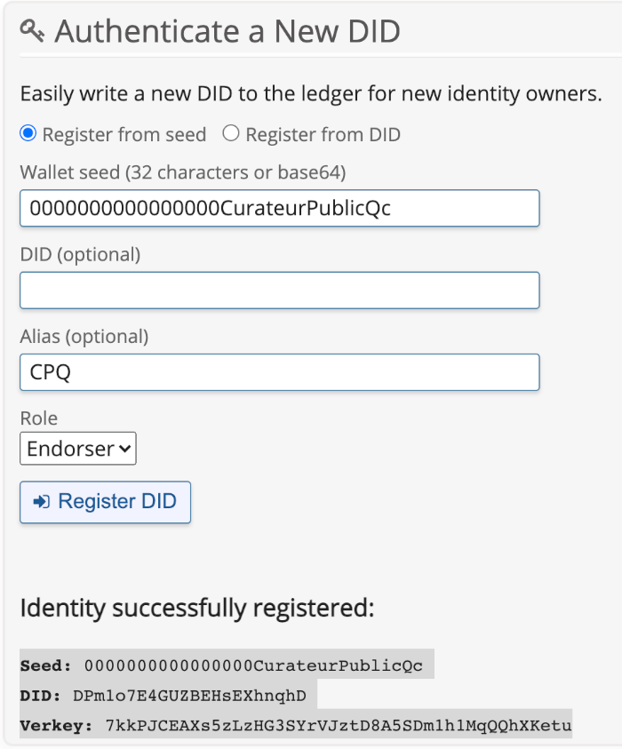

[](https://www.quebec.ca/gouv/politiques-orientations/vitrine-numeriqc/accompagnement-des-organismes-publics/demarche-conception-services-numeriques)
[](/LICENSE_EN)

---
[Version Française](README_fr_CA.md)

# Air Secur Voyages verifier application 

CQEN's experimentation environment is based on AWS & OpenShift (OKD).

To run this project, you should install the following components: 

- a Blockchain; 
- a block explorer (Ledger Client)
- a database (kms - key management service)
- a communication agent (Agent)
- a controller website (controller)

---

## Configure the distributed ledger 

To run the experimentations, you can use a distributed ledger already deployed, as the [Sovrin's Staging Net](https://sovrin.org), or you can install your own [VON-Network](https://github.com/bcgov/von-network) - it is an Indy development level network node, that includes a block explorer (Ledger Client). 

---
## Configure the communication agent 

### [Optional] Customizing Labels

If you want to change the name of the organizations used in the demo, you can specify the "AGENT_NAME" parameter when launching the deployment templates. 

### Create a public DID in your blockchain

So that the communication agent is able to issue certificates, it is necessary to create a public DID on your blockchain or reuse the one from the demo '000000000000DirectorEtatCivilQc'. If you have installed a British Columbia's [VON-Network](https://github.com/bcgov/von-network) and you have configured the block explorer, you can use its GUI to create a public DID. If you are using a different blockchain than your own, you will need to use the tools provided to do so.

<p align="center">
  

  <br>
  <b>DID creation</b>
</p>

---

## Create the Openshift project 

You can proceed by your graphical interface or follow the command line procedure.

- Authenticate to OpenShift on your terminal, usually you will find the command line to use in the GUI

```bash
oc new-project exp-verifier-voyages --display-name="Air Secur Voyages" --description="VC verifier application - Air Secur Voyages"
```

Make sure you're on the right project. 

```bash
oc project exp-verifier-voyages
```

---

## Configure github access key (optional, only if your GitHub repository is private)

### Create the key's directory 

This directory, part of the .gitignore, will allow you not to disclose your cryptographic key pairs.

```bash
mkdir .ssh
cd .ssh
```

### Create SSH Deployment Keys

```bash
ssh-keygen -C "openshift-source-builder/exp-verifier-voyages@github" -f exp-verifier-voyages -N ''
```

### Configure the deployment private key in the OpenShift project

```bash
oc create secret generic exp-verifier-voyages --from-file=ssh-privatekey=exp-verifier-voyages --type=kubernetes.io/ssh-auth
```

oc delete secret exp-verifier-voyages

```bash
oc secrets link builder exp-verifier-voyages
```

### Configure the deployment public key in the GitHub project

Copy the key on Windows

```bash
xclip -sel c < exp-verifier-voyages.pub
```

Copy the key on Mac OSX

```bash
cat exp-verifier-voyages.pub | pbcopy
```

Open your github repository, ours is: https://github.com/CQEN-QDCE/exp-verifier-voyages.git

- In the tab 'Settings',
- under tab 'Deploy keys',
  - delete the key named 'openshift-source-builder' if it exists
- Add a key named 'openshift-source-builder'
- 
and paste the contents of the public key retrieved with the command xclip or pbcopy (CTRL-V) or (CMD-V)

### Delete key files

```
rm exp-verifier-voyages && rm exp-verifier-voyages.pub
```
> **_NOTE:_** This step is used not to unnecessarily leave sensitive information lying around on your workstation.
---

## Start the installation of the controllers

```bash
oc process -f openshift/templates/bcovrin-agent-template.yml -p GITHUB_WEBHOOK_SECRET='$(cat .ssh/exp-verifier-voyages)' | oc apply -f -
```

## Post-deployment adjustments

Some additional adjustments are required after the first deployment. To adjust, do this:

1. Access your OpenShift console;

2. Select the project you just deployed;

### Adjust the application configuration
3. In the navigation menu, open the "Workloads" option;

4. Select the 'Config Maps' option;

5. Open 'exp-verifier-voyages' for editing;

6. Modify the values ​​of the 'config.js' key with those generated in the previous steps.

### Ajuster les variables d'environnement

7. In the navigation menu, in the 'Workloads' section, select 'Deployment Configs';

8. Select 'exp-verifier-voyager';

9. In the 'Environment' tab, adjust the following values:

    * AGENT_DID_SEED -> Initialization value of the decentralized agent public identifier (ex: 000000000000DirecteurEtatCivilQc)

    * AGENT_DID -> Public decentralized identifier of the agent (ex: Ep31SvFAetugFPe5CGzJxt)

    * GENESIS_FILE_URL -> Genesis file download URL

    * AGENT_ENDPOINT -> Inbound agent endpoint

    * AGENT_ADMIN_ENDPOINT -> Outbound agent endpoint

10. Save;

11. Select 'exp-verifier-voyages';

12. In the 'Environment' tab, modify the following values:

    * REACT_APP_ISSUER_HOST_URL -> Agent URL;

13. Save. 